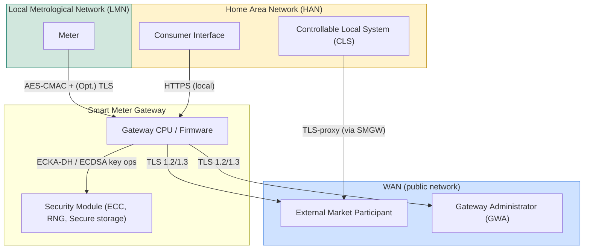
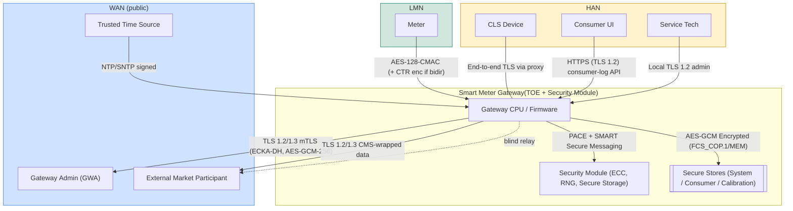

## Smart Metering Gateway

### Components

#### Standard Table

| #      | Components                                             | Component / Node (as labelled) | Level‑0? | Level‑1                                | Description                                                                                                                                                             |
| ------ | ------------------------------------------------------ | ------------------------------ | -------- | -------------------------------------- | ----------------------------------------------------------------------------------------------------------------------------------------------------------------------- |
| **1**  | **[[Smart Meter Gateway]] (TOE + Security Module)**    | ✔                              | ✔        | Trust‑boundary block (process cluster) | Physical gateway enclosure: hardware, firmware and the certified security‑module (BSI TR‑03109) that performs crypto, key storage and PACE secure‑messaging.            |
| **2**  | ├─ **Gateway CPU / Firmware**                          | —                              | ✔        | Process                                | Main ARM/SoC running metering OS: implements TLS, CMS, ACLs, logging, PACE client and the application logic that enforces processing/communication profiles.            |
| **3**  | ├─ [[Security Module]]                                 | —                              | ✔        | Process                                | Tamper‑resistant chip (SecMod‑PP). Provides ECDSA key‑gen/sign, ECKA‑DH, DRBG, and secure storage. Communicated with via PACE + proprietary **SM@RT** secure‑messaging. |
| **4**  | └─ **Secure Stores (System / Consumer / Calibration)** | —                              | ✔        | Data store                             | Encrypted (AES‑GCM) flash/EEPROM partitions that hold configuration, audit logs, processing profiles and billing data.                                                  |
| **5**  | **[[Gateway Administrator]] (GWA)**                    | ✔                              | ✔        | External entity                        | Backend service that installs updates, edits processing & communication profiles, receives alarms. Communicates over mutually‑authenticated TLS 1.2/1.3.                |
| **6**  | **External Market Participant (EMP)**                  | ✔                              | ✔        | External entity                        | DSO/utility back‑office or third‑party aggregator that receives (possibly CMS‑wrapped) metering data, or sends control commands (via TLS proxy).                        |
| **7**  | **Trusted Time Source**                                | ✔                              | ✔        | External entity                        | Authenticated NTP/SNTP server used to discipline the SMGW real‑time clock (FPT_STM).                                                                                    |
| **8**  | [[Meter]]                                              | ✔                              | ✔        | External entity (LMN)                  | Electricity / gas / water meter in LMN. Pushes records to the gateway via AES‑CMAC (+ optional CTR encryption) or bidirectional TLS depending on capability.            |
| **9**  | **CLS Device**                                         | ✔                              | ✔        | External entity (HAN)                  | Controllable local system: heat‑pump, EV charger, PV inverter… Uses the TLS‑proxy to reach EMPs and can request locally generated key‑pairs.                            |
| **10** | **Consumer UI**                                        | ✔                              | ✔        | External entity (HAN)                  | Smartphone / in‑home display accessing consumer log & real‑time data over HTTPS (local TLS).                                                                            |
| **11** | **Service Tech (SRV)**                                 | ✔                              | ✔        | External entity (HAN)                  | Field‑service tool that performs diagnostics, resets or user‑data‑wipe; authenticated with SRV cert + local TLS.                                                        |
| **12** | **WAN (public)**                                       | ✔                              | ✔        | Network / trust boundary               | Untrusted IP network; all SMGW outbound channels traverse here.                                                                                                         |
| **13** | **LMN**                                                | ✔                              | ✔        | Network                                | Local Metrological Network: wired or wireless links from meters to SMGW; considered secure only via link‑layer or upper‑layer crypto.                                   |
| **14** | **HAN**                                                | ✔                              | ✔        | Network                                | Home Area Network: LAN/WLAN segment hosting consumer devices & CLS.                                                                                                     |

#### Table Enriched with Protocols
| #      | Component (as labelled)                             | L‑0 | L‑1 | Principal protocols / artefacts<br>(most important first)                                                                                                                                                             | Short description / role                                                                                                                     |
| ------ | --------------------------------------------------- | --- | --- | --------------------------------------------------------------------------------------------------------------------------------------------------------------------------------------------------------------------- | -------------------------------------------------------------------------------------------------------------------------------------------- |
| **1**  | **[[Smart Meter Gateway]] (TOE + Security Module)** | ✔   | ✔   | • **TLS 1.2 / 1.3** – RFC 5246 / 8446  <br>• **CMS** – RFC 5652 + BSI‑TR‑03109‑3 §2.2  <br>• **PACE + SM@RT Secure‑Messaging** – BSI‑TR‑03110 & SecMod‑PP  <br>• **AES‑GCM data‑at‑rest** – NIST FIPS‑197, SP 800‑38D | Physical gateway device; enforces processing / communication profiles, hosts CPU, Security‑Module and encrypted log stores.                  |
| **2**  | ├─ Gateway CPU / Firmware                           | —   | ✔   | • mTLS/TLS proxy (above)  <br>• **ECDH(E)‑based key agreement** (uses Sec‑Module)  <br>• **AES‑GCM/CCM/CBC**, **HMAC‑SHA‑2** – BSI‑TR‑03111  <br>• **NTP/SNTP client with RFC 5906 auth**                             | Embedded OS & app stack. Implements firewall, logging (FAU), access control (FDP), local HTTPS UI, and interfaces to HAN/LMN.                |
| **3**  | ├─ Security Module                                  | —   | ✔   | • **ECKA‑DH / ECKA‑EG** – BSI‑TR‑03111 & TR‑03110‑3  <br>• **ECDSA‑P‑256/P‑384/BP‑256/384** – SEC 1, RFC 5480  <br>• **DRBG** – SP 800‑90A/B  <br>• **PACE** – TR‑03110‑2; **SM@RT** secure messaging                 | Certified smart‑card‑class IC providing tamper resistance, private‑key storage and random‑number generation.                                 |
| **4**  | └─ Secure Stores (System / Consumer / Calibration)  | —   | ✔   | • AES‑GCM‑256 (FCS_COP.1/MEM)  <br>• Integrity tags stored beside ciphertext                                                                                                                                          | Encrypted flash / EEPROM partitions holding meter data, logs, profiles.                                                                      |
| **5**  | **Gateway Admin (GWA)**                             | ✔   | ✔   | • **TLS 1.2/1.3 mTLS** (RFC 5246/8446) with ECDSA certs  <br>• **Wake‑up message** – CMS‑signed JSON per TR‑03109‑1 §5.7                                                                                              | Backend that manages profiles, firmware, and reads system & calibration logs.                                                                |
| **6**  | **External Market Participant (EMP)**               | ✔   | ✔   | • TLS 1.2/1.3 (server‑auth)  <br>• **CMS‑wrapped datasets** (TR‑03109‑3 §2.3)  <br>• Optional IEC 61968/70 payloads                                                                                                   | Receives billing data or sends control commands (via proxy) for demand‑response.                                                             |
| **7**  | **Trusted Time Source**                             | ✔   | ✔   | • **NTP v4 / SNTP** with symmetric MAC (RFC 5905/5906) or x509‑signed **NTS** (RFC 8915)                                                                                                                              | Provides accurate, authenticated time to satisfy FPT_STM/ST2.                                                                                |
| **8**  | [[Meter]]                                           | ✔   | ✔   | • **AES‑128‑CMAC + CTR enc** (unidirectional meters) – TR‑03109‑3 §3  <br>• Or **TLS 1.2/1.3 mTLS** for bidirectional meters                                                                                          | LMN device that measures commodity usage and sends signed/encrypted records to SMGW.                                                         |
| **9**  | **CLS Device**                                      | ✔   | ✔   | • **Local TLS 1.2/1.3** to SMGW proxy  <br>• **End‑to‑end TLS** to EMP (SMGW acts as blind relay)  <br>• **Key‑pair provisioning** via SMGW (FCS_CKM.1/SERVICE)                                                       | Controllable local system (PV inverter, heat‑pump, EVSE); participates in demand control.                                                    |
| **10** | **Consumer UI**                                     | ✔   | ✔   | • **HTTPS (TLS 1.2/1.3)** with password or cert auth (FIA_UAU.5)  <br>• REST/JSON API documented in TR‑03109‑1 Annex E                                                                                                | Smartphone/in‑home display that reads consumer‑log, current load, tariff info.                                                               |
| **11** | **Service Tech (SRV)**                              | ✔   | ✔   | • Local **TLS 1.2/1.3** with SRV certificate; role limited by FMT_SMR                                                                                                                                                 | Field laptop / handheld used for maintenance, fault‑analysis, user‑data reset.                                                               |
| **12** | **WAN (public)**                                    | ✔   | ✔   | — (untrusted IP transport)                                                                                                                                                                                            | Internet / LTE network. All outbound channels from SMGW traverse here; inbound only via wake‑up UDP and previously‑established TLS sessions. |
| **13** | **LMN (Local Metrological Network)**                | ✔   | ✔   | • wM‑Bus, RS‑485, PLC etc. transport  <br>• Crypto as in #8                                                                                                                                                           | Short‑range network tying one or more meters to the gateway.                                                                                 |
| **14** | **HAN (Home Area Network)**                         | ✔   | ✔   | • Ethernet / Wi‑Fi LAN  <br>• Local TLS for UI / CLS  <br>• IEEE 802.15.4 (optional)                                                                                                                                  | Customer‑side LAN that hosts UI devices and CLS equipment; separated from WAN by SMGW firewall.                                              |
### DFD Level-0


### DFD-Level 1


## DFD-Level 1 with trusted Boundaries
This diagram is the same as the one before, we can take the environments WAN, LMN, HAN and Smart Meter Gateway as boundaries, where we leaf local trusted areas.


This diagram is useful to analyse the following attack vectors, which we can also find in the [[Sicherheitsangriffe]] section.

| What it lets you test                                | Example Stuxnet theme you can mirror                                                       |
| ---------------------------------------------------- | ------------------------------------------------------------------------------------------ |
| Firmware supply-chain threats, rogue update packages | Stuxnet’s legit-signed DLL upgrades ⇾ craft a malicious CMS-wrapped FW update to the SMGW. |
| Endpoint protection vs. USB/physical side channels   | USB autorun exploitation ⇾ SRV laptop compromises HAN, then SMGW.                          |
| Crypto misuse / key-life-cycle errors                | Stuxnet used stolen x509 certs ⇾ look at Sec-Module key-gen and TLS-certificate handling.  |
## Medium and low voltage OT chain
### Components, Zones and Protocols
|Zone (trust boundary)|Core nodes|Typical hardening & BSI-relevant protocols|
|---|---|---|
|**Corporate IT** (least trusted for ICS)|Billing, Engineering WS, Firmware Repo|mTLS, code-signing (TR-03111 §2), AD auth|
|**OT DMZ**|Jump-host, Patch proxy|Dual-NIC, rated firewall, unidirectional rules|
|**Control-Center OT LAN**|SCADA Master, Historian, Secure NTP|IEC-104 + TLS, LDAP-x509, NTS-secured time|
|**WAN (untrusted)**|Carrier/VPN cloud|IPsec, TLS VPNs or BSI-compliant MPLS|
|**Substation Field**|Station-Gateway/RTU, Protection PLC|IEC 61850 MMS/GOOSE, S7CommPlus, CMS-signed FW|
|**Consumer Premises**|SMGW (TOE), LMN meters, HAN CLS|TR-03109 (PACE, CMS, TLS), AES-CMAC link layer|
### DFD-Level 1

```mermaid
%%{init:{
  "flowchart":{
    "defaultRenderer":"elk",
    "padding":20,
    "subGraphTitleMargin":25
  }
}}%%
flowchart TD
	%% ─────────────────────  CORPORATE / IT ZONE  ─────────────────────
	subgraph TB_CORP["Trust Boundary: Corporate-IT  (business, least-trusted)"]
	  direction TB
	  Billing["Billing / Market Systems"]
	  EngWS["Engineering Work-station (TIA Portal)"]
	  PkgSrv["Firmware / Patch Repository"]
	end
	
	%% ─────────────────────  DMZ / SECURITY GATEWAY  ──────────────────
	subgraph TB_DMZ["Trust Boundary: OT DMZ / Jump-Host"]
	  direction TB
	  Jump["Jump-Host / Bastion"]
	  PatchProxy["Patch-Mgmt Proxy"]
	end
	
	%% ─────────────────────  CONTROL-CENTER OT LAN  ───────────────────
	subgraph TB_SCADA["Trust Boundary: Control-Center OT LAN"]
	  direction TB
	  SCADA["SCADA Master (IEC-104 server)"]
	  Hist["Process Historian"]
	  OT_NTP["Secure NTP / PTP grandmaster"]
	end
	
	%% ─────────────────────  WAN / MPLS / VPN  ────────────────────────
	subgraph TB_WAN["Untrusted WAN (IP/MPLS + VPN)"]
	  direction TB
	end
	
	%% ─────────────────────  MEDIUM-VOLTAGE SUBSTATION  ───────────────
	subgraph TB_SUB["Trust Boundary: Substation Field LAN"]
	  direction TB
	  GW_Field["Station Gateway / RTU"]
	  PLC["Protection Relay / PLC"]
	  IED["IED / Sensor"]
	end
	
	%% ─────────────────────  CONSUMER PREMISES  ───────────────────────
	subgraph TB_PREM["Trust Boundary: Consumer Premises"]
	  direction TB
	
	  %% ---- SMGW block ----
	  subgraph TOE["Smart Meter Gateway (TOE + Sec-Module)"]
	      SMGW_CPU["Gateway CPU / Firmware"]
	      SM["Security Module<br/>(PACE, ECDSA, RNG)"]
	      SMGW_CPU -- "PACE + SM@RT" --> SM
	  end
	
	  %% ---- local nets ----
	  subgraph LMN["LMN"]
	    Meter["Meter"]
	  end
	  subgraph HAN["HAN"]
	    CLS["CLS Device"]
	  end
	end
	
	%% =======================  DATA FLOWS  ============================
	%% IT → OT
	EngWS  -. "RDP / SSH (through Jump)" .-> Jump
	Jump   -. "Step-7 RPC / S7CommPlus" .-> PLC
	PkgSrv -. "CMS-signed fw (TLS 1.2)" .-> PatchProxy
	PatchProxy -. "TLS 1.2 (mTLS) fw sync" .-> GW_Field
	
	%% SCADA flows
	SCADA -- "IEC-60870-5-104 over TLS" --> GW_Field
	GW_Field -- "IEC 61850 MMS / GOOSE" --> PLC
	PLC --> IED
	
	%% Time distribution
	OT_NTP -- "NTPv4 MAC / NTS" --> SCADA
	OT_NTP -- "PTP / IEC 61850-9-3" --> GW_Field
	OT_NTP -- "NTP signed" --> SMGW_CPU
	
	%% Smart-metering flows
	Meter -- "AES-CMAC + CTR  (TR-03109-3)" --> SMGW_CPU
	SMGW_CPU -- "TLS 1.2/1.3  CMS-wrapped data" --> SCADA
	CLS ---|"End-to-end TLS (proxy)"| SMGW_CPU
	SMGW_CPU -. "blind relay" .-> SCADA
	
	%% WAN tunnels
	SCADA  -- "IPsec / TLS VPN" --- TB_WAN
	GW_Field -- "IPsec / GRE" --- TB_WAN
	SMGW_CPU -- "TLS 1.2/1.3 mTLS to GWA" --- TB_WAN
	
	%% =======================  STYLING  ===============================
	classDef tb stroke-dasharray:5 4,stroke-width:2px,stroke:#444;
	class TB_CORP,TB_DMZ,TB_SCADA,TB_WAN,TB_SUB,TB_PREM tb;
	classDef wan fill:#cfe2ff,stroke:#3b7ddd,stroke-width:1px
    classDef lmn fill:#d1e7dd,stroke:#117a65,stroke-width:1px
    classDef han fill:#fff3cd,stroke:#bb8c0f,stroke-width:1px
    class WAN wan;
    class LMN lmn;
    class HAN han;

```
