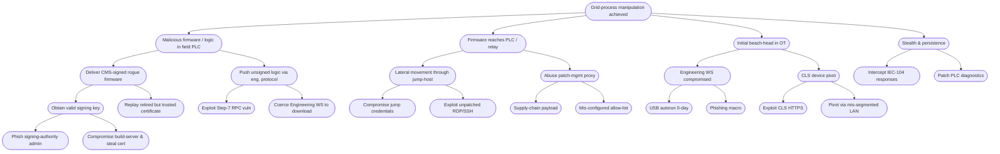

Stuxnet is one if not the best offensive cyber engineering system made to date. It was discovered in June 2010 and is attributed to the joint US-Israeli operation Operation Olympic Games. Its target was the Iranian Natanz uranium enrichment facility with the goal to sabotage their centrifuges used to enrich uranium gas by causing mechanical degradation over time.

## Targeted Devices
- Simens Step 7 PLCs running on S7-300/400 hardware
- Controlled via SIMATIC WinCC/Step7 engineering software
- VFDs (Variable Frequency Drives) made by Fararo Paya (Iran) and Vacon (Finland) - used in centrifuge control

## Attack Chain Overview
|Stage|Description|
|---|---|
|1. Initial Infection|USB-delivered worm infects Windows machines|
|2. Spread & Propagation|Uses multiple 0-days and credential theft|
|3. PLC Identification|Looks for specific Siemens PLCs|
|4. Payload Deployment|Injects rogue ladder logic into PLC|
|5. Stealth & Monitoring|Hooks engineering software to hide changes|
|6. Physical Sabotage|Modifies centrifuge speed in cycles to degrade rotors|
## Step-by-Step Breakdown
### 1. Initial Access 
- Delivered via infected USB drives
- Used LNK exploit (MS10-046) - didn't require user interaction
- Also exploited:
	- MS08-067 (Server Service)
	- MS10-061 (Printer Spooler)
	- MS10-073 (Keyboard layout vulnerability)
4 zero-days were used - unprecedented at the time

### 2. Propagation & Internal Spread
- Used removable drives, shared folders, and print spooler vulnerability
- Extracted Windows credentials via password dumping and token impersonation
- Ensured persistence with Rootkit on Windows:
	- Intercepted API calls
	- Hid its presence from file listings, registry, etc.

### 3. Siemens Software Hooking
- Specifically targeted Siemens Step7 engineering software used to program S7 PLCs
- Injected into:
	- `s7otbxdx.dll` (Step7 library)
	- Hooked APIs to monitor PLC logic changes
- Allowed attackers to:
	- Stealthily upload rogue logic
	- Hide malicious logic from engineers
	- Show "expected" ladder logic in the UI

### 4. PLC Fingerprinting & Check
- Searched for very specific PLC configurations:
	- System controlling rotational speeds
	-  With particular Siemens models (e.g. S7-315, S7-417)
	- Running VFDs from Vacon/Fararo Paya
- Would not activate if the target wasn't a match to avoid detection

### 5. Payload Deployment (PLC Injection)
Once the right PLC was found, Stuxnet injected custom ladder logic:
1. Modulated rotor speeds
	- Sped up and slowed down the centrifuge rotors
	- Normal: ~1064 Hz (arounds 63,840 RPM)
	- Malicious changes:
		- Increased to ~1410 Hz
		- Dropped to ~ 2 Hz
	- Cause physical stress on aluminum rotors $\rightarrow$ microscopic fractures
2. Ran the sabotage intermittently
	- Only activated every few weeks
	- Delayed detection by blending with normal with normal ops
3. Intercepted feedback
	- Fakes sensor readings to HMI/SCADA
	- Operators saw normal pressure/speed values while rotors were being damages

### 6. Stealth & Anti-Forensics
- Hid injected ladder logic from opertaors
- Used rootkit techniques for both:
	- Window layer (hiding files/processes)
	- PLC layer (faking program state)
- Signed with legitimate digital certs stolen from Realtek and JMicron

## Unique Technical Features
|Capability|Description|
|---|---|
|**Multi-zero-day**|4 new 0-days used for propagation|
|**Stolen certs**|Digitally signed to appear legit|
|**Kernel-mode drivers**|Rootkit-level control|
|**PLC rootkit**|Real-time manipulation of Step7 environment|
|**Highly targeted logic**|Required detailed knowledge of Natanz systems|
## Impact
- Estimated that 1 000+ centrifuges were taken offline
- Set back Iran's nuclear program by 1-2 years
- No splashy cyber indicators - it was designed to blend in wear down equipment silently
- First public case of cyber-to-physical warfare

## Stuxnet's Legacy
|Concept|Later Examples|
|---|---|
|Supply chain awareness|Seen in Sunburst, ShadowPad|
|PLC logic manipulation|Triton, Industroyer 2|
|Dual rootkits (Windows + ICS)|PipeDream mirrors this architecture|
|Stealthy, modular payloads|Became standard for APT toolchains|

## Threat Analysis
Based on the smart grid DFD level-1 from [[Dataflow Diagram Smart Grid]] we can perform the following threat analysis. Lets first create an attack tree to see the mode of operation of the stuxnet attack on the smart grid.
### Attack Tree

After this we can continue with the risk matrix, which shows the how high the different risks are.

### Risk Matrix - qualitative
| ID     | Leaf step (from tree)   | STRIDE / Attacktactic                   | **Likelihood**                             | **Impact**                              | **Risk** (L × I) | Notes / existing control                        |
| ------ | ----------------------- | --------------------------------------- | ------------------------------------------ | --------------------------------------- | ------------------- | ----------------------------------------------- |
| 3A-1   | USB 0-day on EngWS      | Initial Access—Removable Media          | **4-High** (field laptops often allow USB) | **4-High** (full STEP-7 project access) | **16 – Severe**     | Disable autorun, endpoint EDR, patch management |
| 3A-2   | Phishing macro → EngWS  | Phishing, User Exec                     | 3-Med                                      | 4-High                                  | 12 – High           | Awareness training, MS-O365 ATP, signed macros  |
| 2A-1   | Creds reuse into Jump   | Lateral Move—Valid Account              | 3-Med                                      | 4-High                                  | 12 – High           | MFA on Jump, PAM vault, session recording       |
| 2A-2   | Exploit RDP vuln        | Lateral Move—Exploit Service            | 2-Low-Med                                  | 4-High                                  | 8 – Med             | Patch SLA, network IPS, NLA-RDP                 |
| 1A-1-a | Steal Firmware-sign key | Credential Access—Exfil Secrets         | 2-Low-Med                                  | 5-Critical (break trust root)           | 10 – High           | HSM-backed code-signing, dual-control, CSP      |
| 1A-2   | Replay retired cert     | Defense Evasion—Comp Valid Cert         | 3-Med                                      | 4-High                                  | 12 – High           | Maintain revocation list in SMGW / RTU          |
| 1B-1   | PLC Step-7 RPC 0-day    | Exec—PLC Exploit                        | 2-Low-Med                                  | 5-Critical                              | 10 – High           | Firmware hardening, segmentation, IDS-ICS       |
| 3B-1   | Exploit CLS via proxy   | Initial Access—Internet-Exposed Device  | 3-Med                                      | 3-Moderate (pivot needs more)           | 9 – Med             | SMGW firewall, CLS TR-03109-5 certs             |
| 4A     | IEC-104 response spoof  | Defense Evasion / Impact—Impair Process | 2-Low-Med                                  | 5-Critical                              | 10 – High           | Deep-packet inspection, sequence-number check   |
| 4B     | Patch PLC diagnostics   | Defense Evasion—Modify Controller       | 2-Low-Med                                  | 5-Critical                              | 10 – High           | Signed logic + periodic offline checksum        |

This is the heat map of the risk matrix, which is also simplified for better visibility, as they overlap at different points.
![[risk_matrix_stuxnet_smart_grid 2.png]]