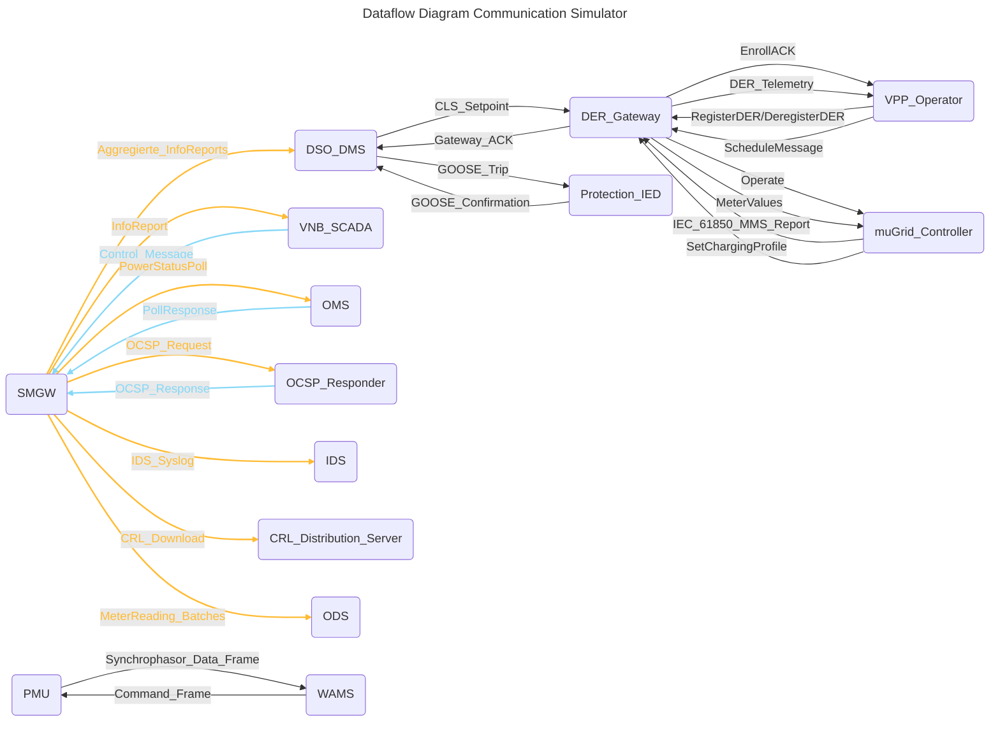

## 1. Normative Dokumente & Referenzen

- **BSI TR-03109-1 bis -5** (FNN-Mikroprozesse, CLS, Security-Profile)
- **IEC 61850-7-2 / -7-3 / -7-4** (ACSI, Datentypen, Logical Nodes)
- **IEC 61850-90-5** (Routable Sampled Values)
- **IEC 62351-3 / -5 / -6** (TLS-Profile, SV/GOOSE-Security, Key Management)
- **IEEE C37.118.2** (Synchrophasor Data Frame & Command Frame)
- **OpenADR 2.0b**, **IEC 63110**, **IEC 61968-9**, **ISO 15118-20** etc. für die speziellen Use-Cases

> **Beschaffung:** Besorge dir die PDF-Versionen über deinen Normen-Account oder lokale Bibliothek.

## 2. XML/JSON-Schemas & SCL-Vorlagen

- **FNN-XSDs** für InfoReport (TAC-Container), ControlMessages (CLS)    
- **IEC 61850 SCL-Schemas** (Substation Configuration Language) für LN-Definitionen
- **CIM-Profile** (IEC 61970/61968) für Netzdaten
- **OpenADR-Schemas** (oadrDistributeEvent, oadrReport)
- **GreenButton JSON**, **ANSI C12.22 XML**, **DLMS-COSEM JSON**

> **Tools:** Einsatz eines Schema-Validators (xmllint, JSON Schema Validator).

## 3. PKI- und Zertifikats-Assets

- **SM-PKI Root & Issuing CA** inkl. CRL-Distribution-Points & OCSP-Responder-URLs    
- **HSM/Soft-HSM** für private Schlüssel (PKCS#11-Interface)
- **Zertifikatsprofile** (Key Usage, EKU) für Server/Client/GOOSE/SV-Keys
- **OCSP-Stapling-Konfiguration** für schnellen Status-Check

> **Tools:** OpenSSL, certtool, cfssl, SoftHSM2.

## 4. Code-Bibliotheken & Frameworks

- **TLS-Stack** mit TLS 1.2/1.3 (OpenSSL, mbedTLS)    
- **CMS-Implementation** (RFC 5652) zum Signieren/Verifizieren (BouncyCastle, OpenSSL-CMS)
- **IEC 61850-Client/Server** (libIEC61850, openIEC61850)
- **DLMS/COSEM-Stack** (gurux)
- **OPC UA-SDK**, **Modbus-TCP**, **SunSpec-Lib**, **OpenADR-SDK**
- **Phasor-Streaming** (openPMU, pyPMU) für IEEE C37.118

> **Build:** Baue als modulare Microservices, z. B. in Go, Java oder C++.

## 5. Simulations- und Test-Framework

- **Netz-Simulator** (GridLAB-D, pandapower) für Stromfluss- und Spannungsprofile    
- **Co-Simulation** (Mosaik, HELICS) für Kommunikations-/Power-Kopplung
- **Traffic-Generator** (Scapy, Ostinato) für GOOSE/SV/DNP3-Frames
- **Fault-Injector** (chaos-monkey für Netz-Ausfälle, MITM-Proxies für TLS-Unterbrechung)
- **Performance-Tools** (iperf, ping, tc für QoS-Emulation)

> **CI/CD:** Integriere Tests in Jenkins/GitLab-Pipelines mit Docker-Containern.

## 6. Beispiel-Konfigurationen & Templates

- **TLS-Server/Client-Config** (openssl.cnf-Vorlagen mit Cipher-Restriktionen)    
- **SCL-Projektdateien** für typische Substation-Topologien
- **Certificate Signing Requests (CSR)-Templates** für CA-Automatisierung
- **Docker-Compose** für Test-Netzwerk mit lokalen OCSP-Responder und PKI

> **Repository:** Lege alles versioniert in Git mit klarer Ordnerstruktur ab.

## Komponenten

| Komponenten                    | Beschreibung                                                                                                             |
| ------------------------------ | ------------------------------------------------------------------------------------------------------------------------ |
| Netz-Simulator                 | Erzeugt synthetische Netzzustandsdaten (Spannung, Strom, Pahsoren) und Fehlerscenarien fuer die Co-Simulation            |
| Smart Meter Gateway (SMGW)     | Erfasst Zaehlerdaten, verpackt sie als InfoReports und steuert ueber ControlMessages Hausanschlussgeraete                |
| VNB-SCADA / VNB-Backend        | Leitsystem des Verteilnetzbetreibers fuer Smart-Meter-Daten und CLS-Steuerung (Load-/Generation-Commands)                |
| DSO-DMS                        | Distribution Management System: Netzueberwachung, Lastfluss- und Spannungsregelung, FLISR-Funktionen                     |
| DER-Gateway                    | Schnittstelle zu dezentralen Erzeugungs- bzw. Speicheranlagen fuer Setpoints (P/Q) und Telemetrie (ACK, Status)          |
| PMU (Phasor Measurement Unit)  | Messen von Phasorgroessen (U/I, Frequenz, ROCOF) mit PTP-Zeitstempel und Streaming an WAMS                               |
| WAMS-Backend / PDC             | Phasordaten-Konzentrator und Analyseplattform fuer Wide-Area Monitoring & Protection (WAMPAC, State Estimation)          |
| Protection-IED                 | Schutzrelais fuer Distanzschutz, Differentialschutz, trippt und isoliert fehlerhafte Netzzonen via GOOSE                 |
| VPP-Operator                   | Virtuelles Kraftwerks-Management: Registrierung/Deregistrierung, Aggergation von Forecasts und Schedules                 |
| Microgrid-Controller           | Bedienoberflaeche und Steuerungfseben fuer grid-connected Microgrids; zeigt MMS-Reports und sendet Dispatch-Befehle      |
| EVSE-Gateway                   | Schnittstelle zu Ladestationen: V2G-Setpoints (ISO 15118), Messwerte ([[IEC 63110]]) und Lade-ACKs                       |
| Operational Data Store (ODS)   | Data Warehouse/Clearinghouse: Batch-Transfer anonymisierte Meter-Readings und historischer Datensaetze                   |
| Outage management System (OMS) | System fuer Ausfallermittlung: Polling von Smart Meter Gateways (ANSI C12.22/DLMS) und Auswerten von Responses           |
| OCSP-Responder                 | On-Line Certificate Status Protocol: gibt in Echtzeit den Wiederrufstatus von [[X.509]]-Zertifikaten aus.                |
| CRL-Distribution Server        | Stellt Certificate Revocation List (CRLs) bereit, damit Clients Zertifikats gueltigkeit pruefen koennen.                 |
| IDS/SIEM (SOC)                 | Empfaengt IDS-Alarme via Syslog, korreliert Security-Events und priorisiert Vorfaelle fuer das Security Operation Center |

## Kommunikation

| Komoponente               | Kommuniziert mit                                                | Datentyp/Nachricht                                                                                      | Protokoll/Schema                                                                                                                                       |
| ------------------------- | --------------------------------------------------------------- | ------------------------------------------------------------------------------------------------------- | ------------------------------------------------------------------------------------------------------------------------------------------------------ |
| Smart Meter Gateway       | VNB-[[SCADA - Supervisory Control and Data Acquisition\|SCADA]] | $\rightarrow$ InfoReport (TAC-Container) $\leftarrow$ Control Message (TargetPower / LoadReduction)  | $\rightarrow$ HTTPS/TLS 1.2+ mit CMS-signiertem JSON/XML (FNN-XSD/JSON-Schema) $\leftarrow$ HTTPS/TLS 1.2+ mit CMS-signiertem CLS-JSON (TR-03109-5) |
| Smart Meter Gateway       | [[Distribution System Operator\|DSO]]-[[DMS]]                   | $\rightarrow$ Aggregierte InforReports                                                                  | $\rightarrow$ HTTPS/TLS1.2+ mit CIM-XML ([[IEC 61970]]-9)                                                                                              |
| DSO-DMS                   | [[DER-Gateway]]                                                 | $\rightarrow$ CLS-Setpoint (TargetPower / LoadReduction) $\leftarrow$ Gateway-ACK (ControlAck)       | $\rightarrow$ HTTPS/TLS 1.2+ mit CMS-signiertem CLS-JSON (TR-03109-5) $\leftarrow$ HTTPS/TLS 1.2+ mit einfachem JSON                                |
| PMU                       | [[WAMS]]-Backend                                                | $\rightarrow$ Synchrophasor Data Frame $\leftarrow$ Command Frame (Control Frame)                    | $\rightarrow$ [[IEC 61850]]-90-5 over UDP/IP + TLS ([[IEC 62351]]-5), IEEE C37.118.2 $\leftarrow$ IEC 61850-90-5 over UDP/IP + TLS                  |
| DSO-DMS                   | Protection-IED                                                  | $\rightarrow$ [[GOOSE]] Trip/Operate Frames $\leftarrow$ GOOSE Confirmation                          | $\rightarrow$ IEC 61850-GOOSE TLS-getunnel (IEC 62351-6) $\leftarrow$ IEC 61850-GOOSE                                                               |
| VPP-Operator              | DERGateway                                                      | $\rightarrow$ RegisterDer / DeregisterDER $\leftarrow$ EntrollAck                                    | $\rightarrow$ HTTPS/TLS 1.2+ mit CMS-signiertem IEC 63110 DeviceProvisioning $\leftarrow$ HTTPS/TLS 1.2+ mit einfachem JSON                         |
| VPP-Operator              | DERGateway                                                      | $\rightarrow$ ScheduleMessage (Day-Ahead / Forecast) $\leftarrow$ Telemetrie (DERTelemetry)          | $\rightarrow$ AS4/ebMS3 over HTTPS/TLS 1.2+ mit CMS-signiertem CIM-XML $\leftarrow$ HTTPS/TLS 1.2+ mit CMS-signiertem JSON ([[IEEE 2030.5]])        |
| $\mu$Grid-Controller / UI | DER-Gateway                                                     | $\rightarrow$ [[IEC 61850]]-[[MMS]] Reports (1 s-Raster) $\leftarrow$ Control (Operate, TargetPower) | $\rightarrow$ MMS over TCP/TLS (IEC 62351-3) $\leftarrow$ MMS/TLS oder CLS-JSON                                                                     |
| $\mu$Grid-Controller / UI | EVSE-Gateway                                                    | $\rightarrow$ SetChargingProfile $\leftarrow$ MeterValues (P/Q, SOC)                                 | $\rightarrow$ ISO 15118-20 ‘ScheduleExchange’ over TLS 1.3 $\leftarrow$ IEC 63110 ‘MeterValues’ over TLS                                            |
| Smart Meter Gateway       | Operational Data Store                                          | $\rightarrow$ MeterReading Batches                                                                      | $\rightarrow$ SFTP/TLS 1.3 oder HTTPS/TLS 1.3 + CIM-XML / GreenButton JSON                                                                             |
| Smart Meter Gateway       | Outage Management System                                        | $\rightarrow$ PowerStatusPoll $\leftarrow$ PollResponse (Outage-Status)                              | $\rightarrow$ ANSI C12.22 / [[DLMS]]-[[COSEM]] over TLS $\leftarrow$ ANSI C12.22 / DLMS-COSEM over TLS                                              |
| Smart Meter Gateway       | OCSP-Responder                                                  | $\rightarrow$ OCSP Request $\leftarrow$ OCSP Response                                                | $\rightarrow$ HTTP(S) $\leftarrow$ HTTP(S)                                                                                                          |
| Smart Meter Gateway       | CRL-Distribution Server                                         | $\rightarrow$ CRL Download                                                                              | $\rightarrow$ HTTP(S)                                                                                                                                  |
| Smart Meter Gateway       | IDS/SIEM (SOC)                                                  | $\rightarrow$ IDS-Syslog Alarme                                                                         | $\rightarrow$ Syslog ([[RFC 5424]]) over TLS ([[RFC 5425]])                                                                                            |

