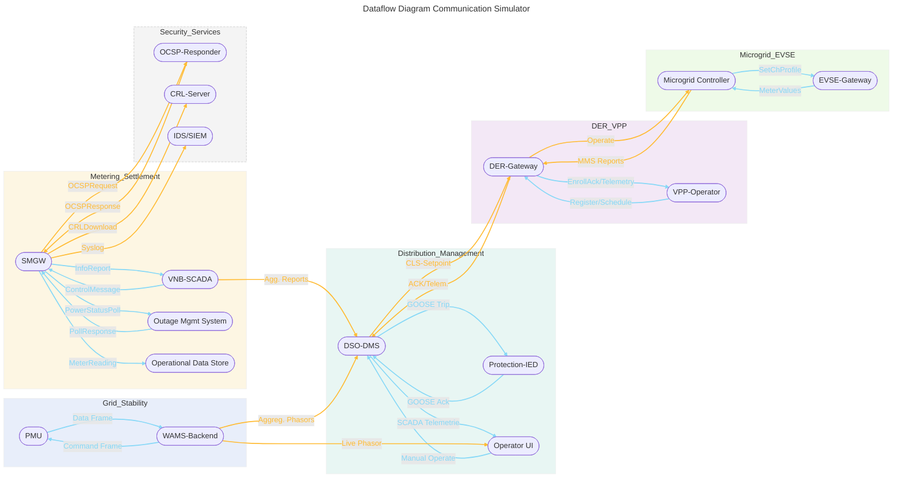

## Komponenten

| Komponenten                    | Beschreibung                                                                                                             |
| ------------------------------ | ------------------------------------------------------------------------------------------------------------------------ |
| CRL-Distribution Server        | Stellt Certificate Revocation List (CRLs) bereit, damit Clients Zertifikats gueltigkeit pruefen koennen.                 |
| DER-Gateway                    | Schnittstelle zu dezentralen Erzeugungs- bzw. Speicheranlagen fuer Setpoints (P/Q) und Telemetrie (ACK, Status)          |
| DSO-DMS                        | Distribution Management System: Netzueberwachung, Lastfluss- und Spannungsregelung, FLISR-Funktionen                     |
| EVSE-Gateway                   | Schnittstelle zu Ladestationen: V2G-Setpoints (ISO 15118), Messwerte ([[IEC 63110]]) und Lade-ACKs                       |
| IDS/SIEM (SOC)                 | Empfaengt IDS-Alarme via Syslog, korreliert Security-Events und priorisiert Vorfaelle fuer das Security Operation Center |
| Microgrid-Controller           | Bedienoberflaeche und Steuerungfseben fuer grid-connected Microgrids; zeigt MMS-Reports und sendet Dispatch-Befehle      |
| Netz-Simulator                 | Erzeugt synthetische Netzzustandsdaten (Spannung, Strom, Pahsoren) und Fehlerscenarien fuer die Co-Simulation            |
| OCSP-Responder                 | On-Line Certificate Status Protocol: gibt in Echtzeit den Wiederrufstatus von [[X.509]]-Zertifikaten aus.                |
| Operational Data Store (ODS)   | Data Warehouse/Clearinghouse: Batch-Transfer anonymisierte Meter-Readings und historischer Datensaetze                   |
| OperatorUI                     | Dies ist das Grid-Operator-Dashboard, wodurch der Operator mit dem System interagieren kann.                             |
| Outage management System (OMS) | System fuer Ausfallermittlung: Polling von Smart Meter Gateways (ANSI C12.22/DLMS) und Auswerten von Responses           |
| PMU (Phasor Measurement Unit)  | Messen von Phasorgroessen (U/I, Frequenz, ROCOF) mit PTP-Zeitstempel und Streaming an WAMS                               |
| Protection-IED                 | Schutzrelais fuer Distanzschutz, Differentialschutz, trippt und isoliert fehlerhafte Netzzonen via GOOSE                 |
| Smart Meter Gateway (SMGW)     | Erfasst Zaehlerdaten, verpackt sie als InfoReports und steuert ueber ControlMessages Hausanschlussgeraete                |
| VNB-SCADA / VNB-Backend        | Leitsystem des Verteilnetzbetreibers fuer Smart-Meter-Daten und CLS-Steuerung (Load-/Generation-Commands)                |
| VPP-Operator                   | Virtuelles Kraftwerks-Management: Registrierung/Deregistrierung, Aggergation von Forecasts und Schedules                 |
| WAMS-Backend / PDC             | Phasordaten-Konzentrator und Analyseplattform fuer Wide-Area Monitoring & Protection (WAMPAC, State Estimation)          |

## Kommunikation

| Komoponente               | Kommuniziert mit                                                | Datentyp/Nachricht                                                                                                                   | Protokoll/Schema                                                                                                                                       |
| ------------------------- | --------------------------------------------------------------- | ------------------------------------------------------------------------------------------------------------------------------------ | ------------------------------------------------------------------------------------------------------------------------------------------------------ |
| Smart Meter Gateway       | VNB-[[SCADA - Supervisory Control and Data Acquisition\|SCADA]] | $\rightarrow$ InfoReport (TAC-Container) $\leftarrow$ Control Message (TargetPower / LoadReduction)                               | $\rightarrow$ HTTPS/TLS 1.2+ mit CMS-signiertem JSON/XML (FNN-XSD/JSON-Schema) $\leftarrow$ HTTPS/TLS 1.2+ mit CMS-signiertem CLS-JSON (TR-03109-5) |
| Smart Meter Gateway       | [[Distribution System Operator\|DSO]]-[[DMS]]                   | $\rightarrow$ Aggregierte InforReports                                                                                               | $\rightarrow$ HTTPS/TLS1.2+ mit CIM-XML ([[IEC 61970]]-9)                                                                                              |
| DSO-DMS                   | [[DER-Gateway]]                                                 | $\rightarrow$ CLS-Setpoint (TargetPower / LoadReduction) $\leftarrow$ Gateway-ACK (ControlAck)                                    | $\rightarrow$ HTTPS/TLS 1.2+ mit CMS-signiertem CLS-JSON (TR-03109-5) $\leftarrow$ HTTPS/TLS 1.2+ mit einfachem JSON                                |
| PMU                       | [[WAMS]]-Backend                                                | $\rightarrow$ Synchrophasor Data Frame $\leftarrow$ Command Frame (Control Frame)                                                 | $\rightarrow$ [[IEC 61850]]-90-5 over UDP/IP + TLS ([[IEC 62351]]-5), IEEE C37.118.2 $\leftarrow$ IEC 61850-90-5 over UDP/IP + TLS                  |
| DSO-DMS                   | Protection-IED                                                  | $\rightarrow$ [[GOOSE]] Trip/Operate Frames $\leftarrow$ GOOSE Confirmation                                                       | $\rightarrow$ IEC 61850-GOOSE TLS-getunnel (IEC 62351-6) $\leftarrow$ IEC 61850-GOOSE                                                               |
| VPP-Operator              | DERGateway                                                      | $\rightarrow$ RegisterDer / DeregisterDER $\leftarrow$ EntrollAck                                                                 | $\rightarrow$ HTTPS/TLS 1.2+ mit CMS-signiertem IEC 63110 DeviceProvisioning $\leftarrow$ HTTPS/TLS 1.2+ mit einfachem JSON                         |
| VPP-Operator              | DERGateway                                                      | $\rightarrow$ ScheduleMessage (Day-Ahead / Forecast) $\leftarrow$ Telemetrie (DERTelemetry)                                       | $\rightarrow$ AS4/ebMS3 over HTTPS/TLS 1.2+ mit CMS-signiertem CIM-XML $\leftarrow$ HTTPS/TLS 1.2+ mit CMS-signiertem JSON ([[IEEE 2030.5]])        |
| $\mu$Grid-Controller / UI | DER-Gateway                                                     | $\rightarrow$ [[IEC 61850]]-[[MMS]] Reports (1 s-Raster) $\leftarrow$ Control (Operate, TargetPower)                              | $\rightarrow$ MMS over TCP/TLS (IEC 62351-3) $\leftarrow$ MMS/TLS oder CLS-JSON                                                                     |
| $\mu$Grid-Controller / UI | EVSE-Gateway                                                    | $\rightarrow$ SetChargingProfile $\leftarrow$ MeterValues (P/Q, SOC)                                                              | $\rightarrow$ ISO 15118-20 ‘ScheduleExchange’ over TLS 1.3 $\leftarrow$ IEC 63110 ‘MeterValues’ over TLS                                            |
| Smart Meter Gateway       | Operational Data Store                                          | $\rightarrow$ MeterReading Batches                                                                                                   | $\rightarrow$ SFTP/TLS 1.3 oder HTTPS/TLS 1.3 + CIM-XML / GreenButton JSON                                                                             |
| Smart Meter Gateway       | Outage Management System                                        | $\rightarrow$ PowerStatusPoll $\leftarrow$ PollResponse (Outage-Status)                                                           | $\rightarrow$ ANSI C12.22 / [[DLMS]]-[[COSEM]] over TLS $\leftarrow$ ANSI C12.22 / DLMS-COSEM over TLS                                              |
| Smart Meter Gateway       | OCSP-Responder                                                  | $\rightarrow$ OCSP Request $\leftarrow$ OCSP Response                                                                             | $\rightarrow$ HTTP(S) $\leftarrow$ HTTP(S)                                                                                                          |
| Smart Meter Gateway       | CRL-Distribution Server                                         | $\rightarrow$ CRL Download                                                                                                           | $\rightarrow$ HTTP(S)                                                                                                                                  |
| Smart Meter Gateway       | IDS/SIEM (SOC)                                                  | $\rightarrow$ IDS-Syslog Alarme                                                                                                      | $\rightarrow$ Syslog ([[RFC 5424]]) over TLS ([[RFC 5425]])                                                                                            |
| WAMS-Backend              | OperatorUI                                                      | $\rightarrow$ Live Phasor-Dashboard-Data                                                                                             | $\rightarrow$ WebSocket/TLS mit JSON (custom-Schema)                                                                                                   |
| DSO-DMS                   | OperatorUI                                                      | $\rightarrow$ SCADA Telemetrie (Spannung, Strom, Alarme, Status) $\leftarrow$ Manuelle Steuerbefehle (Swtich, Setpoints, Reclose) | $\rightarrow$ ICE 61850 MMS Report (CIM-XML over TLS) $\leftarrow$ IEC 61850 MMS Operate/SetDataValues over TLS                                     |
| WAMS-Backend              | DSO-DMS                                                         | $\rightarrow$ PhasorReports                                                                                                          | $\rightarrow$ IEC 61850 MMS Report (CIM-XML over TLS)                                                                                                  |

